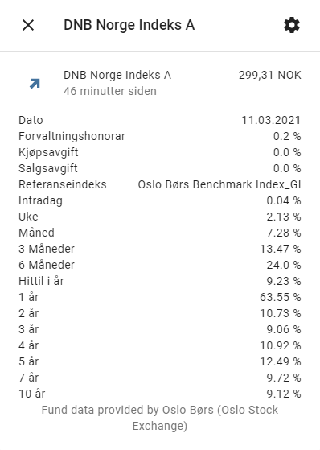
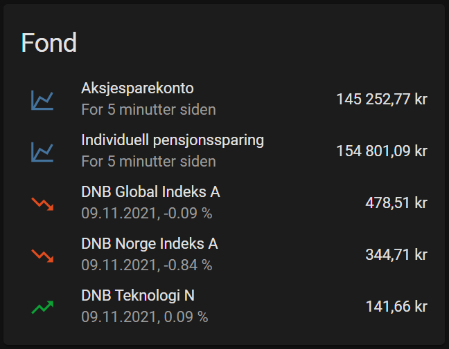

# Oslo Børs fond sensor

The `ob_fond` sensor platform uses [Oslo Børs](https://www.oslobors.no/) API to monitor funds.

## Installation
In your config folder, there should be a subfolder named `custom_components`. If not, you need to create it. Make a new subfolder named `ob_fond` and copy the files from this repository to that folder: `config/custom_components/ob_fond`.

## Configuration
To enable the `ob_fond` platform, add content such as this example to your `configuration.yaml` file:

```yaml
# Example configuration.yaml entry
sensor:
  - platform: ob_fond
    funds:
      - fund: DK-GLBIX.OSE  # DNB Global Indeks A
        currency: "kr"
      - fund: DK-NORIX.OSE  # DNB Norge Indeks A
    scan_interval: 00:15
```

### funds `map, required`
List of funds you want to monitor

### fund `string, required`
Specific funds you want to monitor. The values are taken from the fund's page at [Oslo Børs](https://www.oslobors.no/).
For example DNB Norge Indeks A has the url https://www.oslobors.no/markedsaktivitet/#/details/DK-NORIX.OSE/overview. In that url, use the DK-NORIX.OSE.

### currency `string, optional, default=NOK`
Customize the unit of measurement for the, for instance "kr" instead of the default "NOK"

### scan_interval `time, optional, default=00:10`
Set how often you want the data to refresh. Default is 10 minutes.

## Example: Simple


## Example: Complex


Setting up one or more accounts, customizing icon color (requires [card-mod](https://github.com/thomasloven/lovelace-card-mod)) based on performance, custom secondary info (requires [secondaryinfo-entity-row](https://github.com/custom-cards/secondaryinfo-entity-row)) and automatic notifications on account updates. Both required mods are best installed using [HACS](https://hacs.xyz/).
For the sake of keeping the condiguration file neat, it's best to split it up using extrenal yaml files, like so:

```yaml
# Example configuration.yaml
automation: !include automations.yaml
input_text: !include input_text.yaml
sensor: !include sensors.yaml
template: !include templates.yaml
```
```yaml
# Example sensors.yaml
- platform: ob_fond
  scan_interval: 00:10  #Default 00:05
  funds:
    - fund: DK-GLBIX.OSE  # DNB Global Indeks A
    - fund: DK-NORIX.OSE  # DNB Norge Indeks A
    - fund: DK-DNBTN.OSE  # DNB Teknologi N
```
```yaml
# Example input_text.yaml
# =====================
# Aksjesparekonto (ASK)
# =====================

ask_dnb_global_indeks_a:
  name: "ASK DNB Global Indeks A"
  initial: 123.4567

ask_dnb_teknologi_n:
  name: "ASK DNB Teknologi N"
  initial: 250.0000

# ==================================
# Individuelle pensjonssparing (IPS)
# ==================================

ips_dnb_global_indeks_a:
  name: "IPS DNB Global Indeks A"
  initial: 420.6900

ips_dnb_norge_indeks_a:
  name: "Børre IPS DNB Norge Indeks A"
  initial: 69.0741
```
```yaml
# Example templates.yaml
  - name: "Aksjesparekonto"
    unique_id: "fond_ask"
    unit_of_measurement: "kr"
    state: "{{('{0:.2f}'.format(
      ((states('input_text.ask_dnb_global_indeks_a')|float) * (state_attr('sensor.dnb_global_indeks_a', 'Full pris')|float)) +
      ((states('input_text.ask_dnb_teknologi_n')|float) * (state_attr('sensor.dnb_teknologi_n', 'Full pris')|float))
      ))}}"
    attributes:
      DNB Global Indeks A: "{{ state_attr('sensor.dnb_global_indeks_a', 'Intradag') }}"
      DNB Teknologi N: "{{ state_attr('sensor.dnb_teknologi_n', 'Intradag') }}"

  - name: "Individuell pensjonssparing"
    unique_id: "fond_ips"
    unit_of_measurement: "kr"
    state: "{{('{0:.2f}'.format(
      ((states('input_text.ips_dnb_global_indeks_a')|float) * (state_attr('sensor.dnb_global_indeks_a', 'Full pris')|float)) +
      ((states('input_text.ips_dnb_norge_indeks_a')|float) * (state_attr('sensor.dnb_norge_indeks_a', 'Full pris')|float))
      ))}}"
    attributes:
      DNB Global Indeks A: "{{ state_attr('sensor.dnb_global_indeks_a', 'Intradag') }}"
      DNB Norge Indeks A: "{{ state_attr('sensor.dnb_norge_indeks_a', 'Intradag') }}"
```
```yaml
# Example automations.yaml
- id: fondskonto
  alias: "Fondskontoer - oppdatering"
  trigger:
  - platform: state
    entity_id: sensor.fond_ask
  mode: restart
  action:
  - delay: "00:15:00"
  - service: notify.html5_pixel_4a
    data:
      title: Fondskontoer
      message: "Aksjesparekonto: {{'{:,.2f}'.format(states('sensor.aksjesparekonto')|float)|replace(',',' ')|replace('.',',')}} kr

        IPS-konto: {{'{:,.2f}'.format(states('sensor.individuell_pensjonssparing')|float)|replace(',',' ')|replace('.',',')}} kr

        DNB Global Indeks: {{state_attr('sensor.dnb_global_indeks_a', 'Intradag')}}
        
        DNB Norge Indeks: {{state_attr('sensor.dnb_norge_indeks_a', 'Intradag')}}
        
        DNB Teknologi N: {{state_attr('sensor.dnb_teknologi_n', 'Intradag')}}"
      data:
        tag: ask-update
        url: https://www.morningstar.no/no/portfoliomanager/portfolio.aspx
```
```yaml
# Example lovlace card configuration
title: Fond
type: entities
entities:
  - entity: sensor.aksjesparekonto
    secondary_info: last-changed
  - entity: sensor.individuell_pensjonssparing
    secondary_info: last-changed
  - entity: sensor.dnb_global_indeks_a
    type: custom:secondaryinfo-entity-row
    secondary_info: '[[ {entity}.attributes.Dato ]], [[ {entity}.attributes.Intradag ]]'
    card_mod:
      style: |
        :host {
          --paper-item-icon-color:
            
              var(--label-badge-green)
            
              var(--label-badge-red)
            
              var(--paper-item-icon-color)
            
            ;
        }
  - entity: sensor.dnb_norge_indeks_a
    type: custom:secondaryinfo-entity-row
    secondary_info: '[[ {entity}.attributes.Dato ]], [[ {entity}.attributes.Intradag ]]'
    card_mod:
      style: |
        :host {
          --paper-item-icon-color:
            
              var(--label-badge-green)
            
              var(--label-badge-red)
            
              var(--paper-item-icon-color)
            
            ;
        }
  - entity: sensor.dnb_teknologi_n
    type: custom:secondaryinfo-entity-row
    secondary_info: '[[ {entity}.attributes.Dato ]], [[ {entity}.attributes.Intradag ]]'
    card_mod:
      style: |
        :host {
          --paper-item-icon-color:
            
              var(--label-badge-green)
            
              var(--label-badge-red)
            
              var(--paper-item-icon-color)
            
            ;
        }
```
